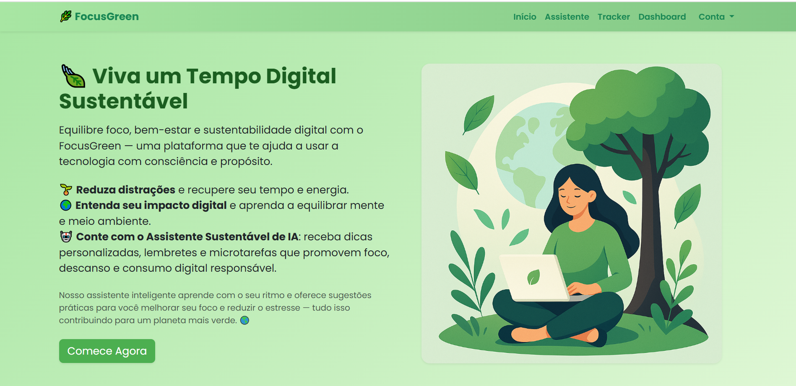
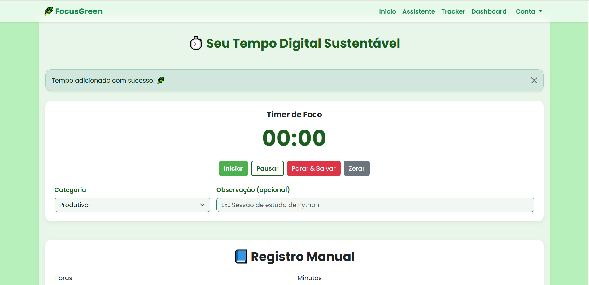
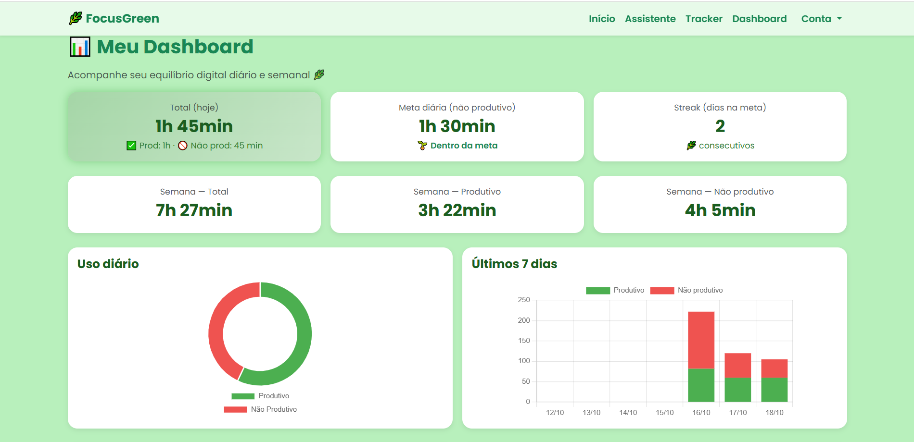
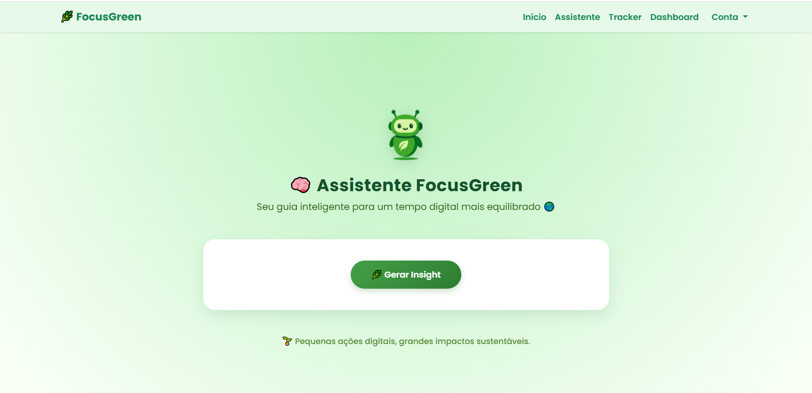
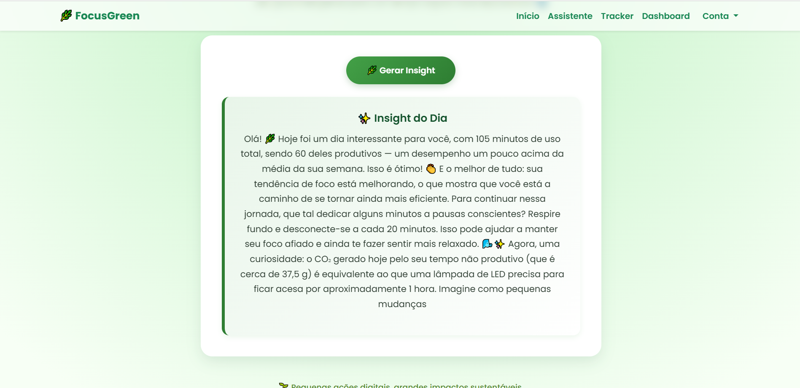

# 🌿 FocusGreen | Tempo Digital Sustentável


---

## 💡 Sobre o Projeto

O **FocusGreen** é uma plataforma web que promove o **uso consciente e sustentável da tecnologia**, ajudando pessoas a compreender e equilibrar seu **tempo digital** de forma saudável e responsável.

A aplicação permite **monitorar o tempo produtivo e não produtivo**, gerar **relatórios diários e semanais**, e receber **insights personalizados de um agente de IA**.  
Esse agente analisa seus hábitos digitais e transforma dados em **conselhos práticos e inspiradores**, mostrando o **impacto ambiental do tempo de tela** e incentivando **um estilo de vida digital mais equilibrado e sustentável**.

> 🌱 “Usar a tecnologia de forma consciente é plantar sustentabilidade no tempo digital.”


---

## 🎯 Objetivos

- Promover **saúde mental** e **equilíbrio digital**.  
- Reduzir o **uso improdutivo** de telas.  
- Conscientizar sobre o **impacto ambiental e mental** do uso digital.  
- Educar sobre **sustentabilidade e foco** no mundo tecnológico.  

---

## 🌍 Conexão com os ODS (ONU)

| **ODS** | **Nome** | **Relação com o Projeto** |
|-----|------|------------------------|
| **ODS 3** | Saúde e Bem-Estar | Incentiva equilíbrio mental e autocontrole digital. |
| **ODS 12** | Consumo e Produção Responsáveis | Ensina consumo digital sustentável. |
| **ODS 13** | Ação Contra a Mudança Global do Clima | Relaciona tempo de tela à economia de energia e CO₂. |

---

## 🖼️ Demonstração reduzida do MVP

### 🏠 Homepage


### ⏱️ Tracker de Tempo


### 📊 Dashboard


### 🤖 Assistente de IA



---

## 🧩 Estrutura do Projeto

A estrutura segue o padrão **MVT (Model–View–Template)** do Django, com apps independentes e bem definidos:

```bash
focusgreen/
├── focusgreen/        # Configurações principais do projeto
├── core/              # Páginas institucionais - homepage, ODS, conceito
├── accounts/          # Autenticação, registro e perfil do usuário
├── tracker/           # Registro de tempo produtivo e não produtivo
├── dashboard/         # Visualizações e métricas - gráficos e CO₂
├── assistant/         # Chat com IA - análise do tempo de tela e dicas de foco e sustentabilidade
├── templates/         # Templates base compartilhados
├── static/            # favicon
└── manage.py
```

---
## 🧩 Tecnologias Utilizadas
O **FocusGreen** combina tecnologias modernas para unir **produtividade**, **IA** e **sustentabilidade digital** em uma experiência fluida e educativa:

- **Python 3.12+** — Linguagem principal da aplicação  
- **Django 5.2.7** — Framework backend para estrutura e gerenciamento de dados  
- **Bootstrap 5.3** — Estilização responsiva e interface intuitiva  
- **HTML5 / CSS3 / JavaScript (ES6+)** — Estrutura, estilo e interatividade do frontend  
- **Chart.js** — Visualização dinâmica dos relatórios e gráficos de desempenho  
- **OpenAI API** — Integração com modelo de linguagem para o agente inteligente  
- **Endpoints personalizados** — Comunicação entre o backend Django e o agente de IA, permitindo análise dos dados e geração de respostas contextuais  
- **Git e GitHub** — Controle de versão e hospedagem do código

> 💡 *A combinação entre dados, IA e sustentabilidade cria uma experiência digital mais consciente e transformadora.*

---

## ⚙️ Como Executar o Projeto Localmente

### 1️⃣ Clone o repositório:
```bash
git clone https://github.com/Luissantos20/focusgreen.git
```

### 2️⃣ Acesse a pasta:
```bash
cd focusgreen
```

### 3️⃣ Crie e ative o ambiente virtual:
```bash
python -m venv venv
venv\Scripts\activate
```

### 4️⃣ Instale as dependências:
```bash
pip install -r requirements.txt
```

### 4️⃣ Execute as migrações:
```bash
python manage.py makemigrations
python manage.py migrate
```

### 5️⃣ Execute o servidor:
```bash
python manage.py runserver
```

Acesse o projeto em:  
👉 **http://127.0.0.1:8000**

---

## 🚧 Status do Projeto

🟢 **MVP em desenvolvimento ativo** — versão funcional construída com **Django**, **Bootstrap** e **integração com IA**.  
Nesta fase, o projeto já possui base sólida e recursos principais implementados.

### 🔹 Versão Atual (MVP)
- Estrutura completa em **Django**  
- Sistema de **rastreamento de tempo diário e semanal**  
- **Integração com a API da OpenAI**, criando um agente inteligente que gera insights personalizados  
- **Visualização de dados** com **Chart.js**  
- Organização modular por apps e pastas *static* independentes  
- Versionamento contínuo com **Git e GitHub**

---

## 🛠️ Funcionalidades — Implementadas e Planejadas

| Status | Funcionalidade | Descrição |
|---------|----------------|-----------|
| ✅ | Estrutura base (Django + apps modulares) | Configuração do projeto e ambiente virtual isolado |
| ✅ | Sistema de monitoramento de tempo | Histórico,registro e categorização de tempo produtivo e não produtivo |
| ✅ | Relatórios diários e semanais | Visualização gráfica do tempo digital e emissões de CO₂ |
| ✅ | Integração com IA (OpenAI API) | Agente que gera insights personalizados com base nos hábitos do usuário |
| ✅ | Interface responsiva | Layout otimizado com Bootstrap e design sustentável |
| 🔜 | Análise mensal e anual | Expansão dos relatórios para períodos maiores e comparativos |
| 🔜 | Edição de meta diária | Usuário poderá ajustar sua meta de tempo não produtivo |
| 🔜 | Alteração de senha pelo perfil | Funcionalidade direta de redefinição segura de senha |
| 🔜 | Histórico de insights da IA | Registro das recomendações e mensagens geradas pelo agente |
| 🔜 | Sistema de recompensas (Streak) | Pontuação e badges por dias consecutivos de uso consciente |

---

## 🔮 Próximos Passos

- [ ] Adicionar **análises mensais e anuais** no painel de relatórios  
- [ ] Permitir **alteração de senha e meta diária** diretamente no perfil do usuário  
- [ ] Implementar **histórico dos insights** gerados pela IA  
- [ ] Criar **sistema de recompensas (dias de streak e conquistas)**  
- [ ] Aprimorar **dashboard visual** com novos componentes e métricas  
- [ ] Realizar **deploy em servidor online** (Render, Railway ou Vercel)

---

## 🧠 Autor

**👨‍💻 Luis Filipe Santos**  
Desenvolvedor Python em formação | Entusiasta em IA e sustentabilidade digital  

📫 Contato: [luissilvassantos@gmail.com](mailto:luissilvassantos@gmail.com)  
🔗 [LinkedIn](https://www.linkedin.com/in/luis-filipe-santos-955458293/)

---

## 🪴 Licença

Este projeto está sob a licença **MIT** — você pode utilizá-lo livremente para fins educacionais e de desenvolvimento, desde que mantenha os devidos créditos.  

---

> “Usar a tecnologia de forma consciente é plantar sustentabilidade no tempo digital.” 🌍


